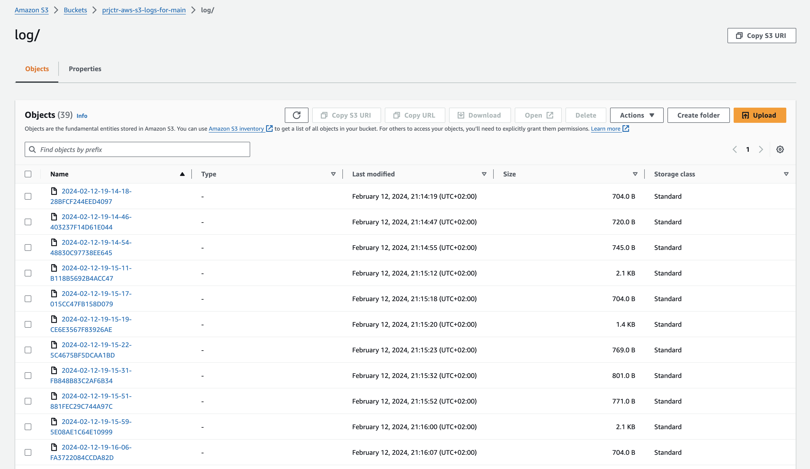

# S3


## How to setup
```bash
terraform init
terraform apply
```


## What's inside

Two S3 buckets will be created:
- `prjctr-aws-s3-main-with-logs-n-object-lock` - main bucket with configured object locking and access logs delivered to `prjctr-aws-s3-logs-for-main`
- `prjctr-aws-s3-logs-for-main` - bucket with access logs

In `prjctr-aws-s3-main-with-logs-n-object-lock` object locking is configured with `GOVERNANCE` retention mode and 5 day retention period.
`GOVERNANCE` mode was chosen to have ability for the bucket owner to remove objects till retention period exceeded.


Access logs:

