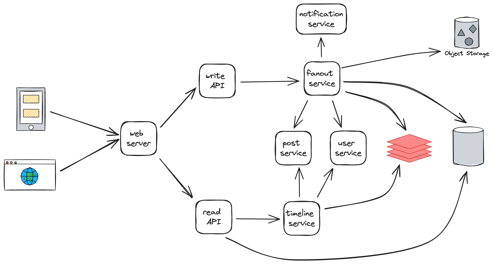
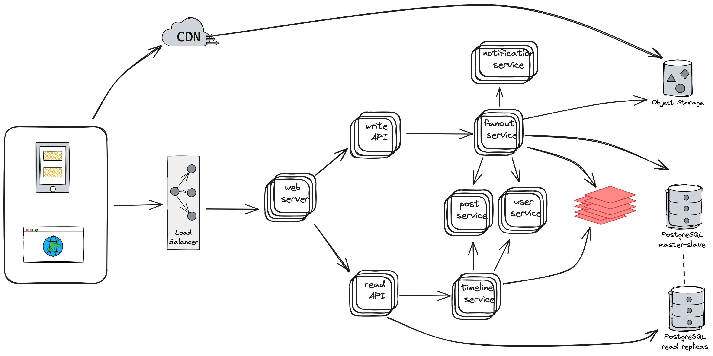

# Design Instagram services

## Use cases

- **User** views feeds 
- **User** makes posts
- **User** likes posts
- **User** comments on posts

### Non-functional assumptions

Due to Bard, Instagram has 500M daily active users and 95 million new posts are uploaded to Instagram every day. For simplicity, assume that image sige is ~500 Kb and video size is ~4Mb. And due to Bard, video takes 1/3 of daily new posts and images 2/3.

## High-leve design

Here each service is represented by one instance. They are potential **SPOFs** in the design. So, to mitigate this risk we should scale them by making a few instances of each service.

After scaling services, possible bottlenecks could storage components - cache, database and object storage.
- **Cache** could be also scaled by adding mor instances. 
- **Database** receives intensive write and read operations. To avoid performance degradation because of the component, we could have separate DB instances for write and read operations. However, having single instance for each type of operation is not enough as each of them are potential SPOFs. To mitigate this risk, we could use replication. In case of write DB instances we'll have master-slave replication.
- **Object storage** could be optimized by using CDN. It will decrease load on this component.

## Scaled design

